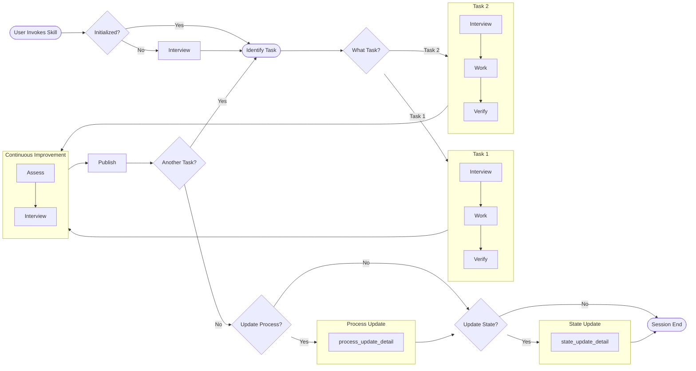

# claude-skills

A collection of custom skills for Claude's computer use feature.

## What Is a Skill?

A skill is a portable bundle (`.skill` file) that extends Claude with persistent workflows and user-specific data. Technically, it's a zip archive containing a `SKILL.md` file with instructions Claude follows, plus any supporting data files.

When installed, skills appear in `/mnt/skills/user/`. Claude reads the `SKILL.md` frontmatter to determine when to invoke the skill based on user queries.

### Skill Structure

```
{skill-name}/
├── SKILL.md          # Core instructions (required)
├── version.txt       # Semantic version
└── ...               # Skill-specific data and templates
```

### Installation

1. Download the `.skill` file
2. In Claude (claude.ai or desktop app), go to **Settings → Skills**
3. Upload the skill bundle

## Data Persistence

User data lives inside the skill bundle. To preserve changes across reinstalls or share with others, ask Claude to export the bundle. Most skills support two export modes: full data export and blank template export (for sharing without personal data).

## UX Patterns

Some effective skill UX patterns are documented.

### Interview and Improve


---

## Skills in This Repo

### book-ranking

Book recommendation and ranking for book clubs.

**Capabilities:**
- Rank candidate books against your preferences and club context
- Maintain per-club profiles and reading history
- Learn from feedback when rankings miss the mark

**Data files:**
- `user-profile.md` — Your reading preferences (fiction/nonfiction balance, density tolerance, exhausted territory)
- `heuristics.md` — Accumulated ranking adjustments from calibration sessions
- `book-clubs/{club}/` — Per-club profiles and reading history

**Example queries:**
- "Rank these five books for my book club"
- "Set up a new book club profile"
- "We just finished [book]—log it"

On first use, the skill runs an initialization interview to populate your reading profile.
